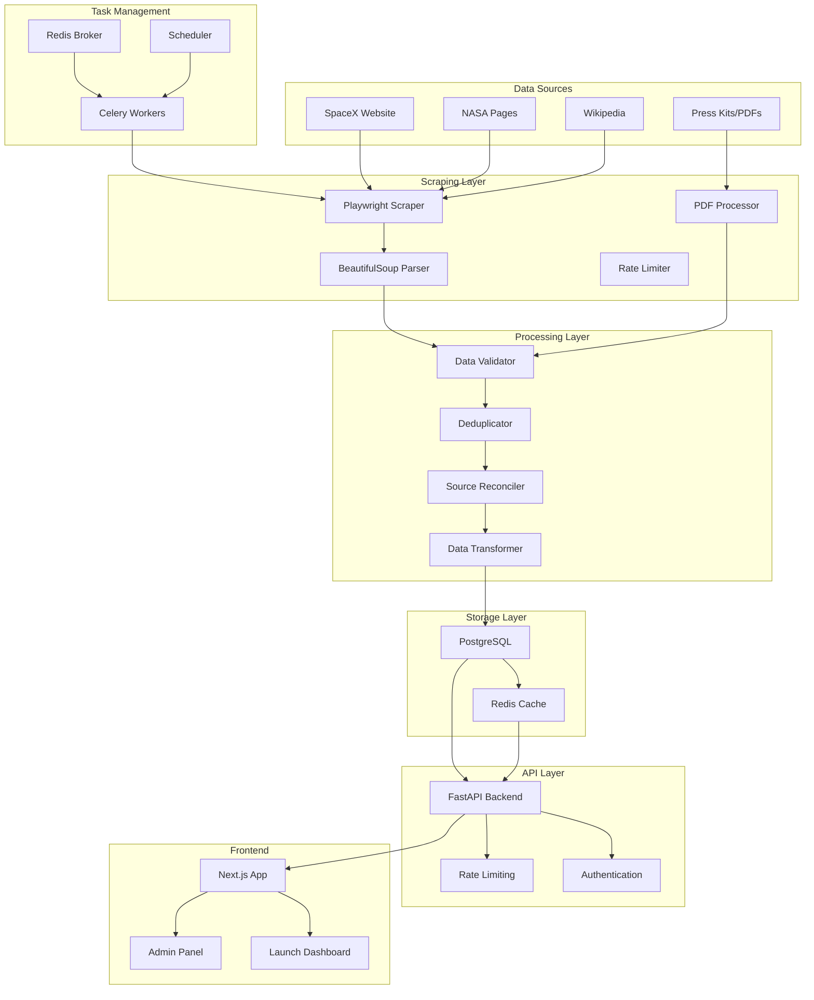

# Design Document

## Overview

The SpaceX Launch Tracker is designed as a modular, fault-tolerant system that ethically scrapes launch data from multiple public sources and presents it through a modern web interface. The architecture follows a layered approach with clear separation of concerns: data acquisition, processing, storage, API, and presentation layers.

The system prioritizes reliability through multi-source data collection, graceful degradation, and comprehensive caching strategies. It implements ethical scraping practices with rate limiting, robots.txt compliance, and randomized request patterns to maintain good relationships with data sources.

## Architecture

### High-Level Architecture



### Component Interaction Flow

1. **Scheduled Scraping**: Celery scheduler triggers scraping tasks every 6 hours
2. **Data Acquisition**: Playwright navigates to sources, BeautifulSoup parses HTML, PDF processor handles documents
3. **Data Processing**: Validation, deduplication, and reconciliation of multi-source data
4. **Storage**: Processed data stored in PostgreSQL with Redis caching
5. **API Access**: FastAPI serves data with authentication and rate limiting
6. **Frontend Display**: Next.js renders launch information with real-time updates

## Components and Interfaces

### Scraping Layer

**Playwright Scraper**
- Handles JavaScript-heavy sites like SpaceX.com
- Implements randomized user agents and headers
- Manages request delays and retry logic
- Respects robots.txt and implements ethical scraping practices

```python
class PlaywrightScraper:
    async def scrape_spacex_launches(self) -> List[Dict]
    async def scrape_nasa_launches(self) -> List[Dict]
    async def handle_rate_limiting(self, delay: int)
    async def randomize_headers(self) -> Dict[str, str]
```

**BeautifulSoup Parser**
- Parses HTML content from scraped pages
- Extracts structured data using CSS selectors
- Handles different page layouts and structures

```python
class LaunchParser:
    def parse_spacex_launch(self, html: str) -> LaunchData
    def parse_nasa_launch(self, html: str) -> LaunchData
    def extract_launch_details(self, soup: BeautifulSoup) -> Dict
```

**PDF Processor**
- Processes press kits and mission documents
- Extracts launch details from PDF content
- Handles various PDF formats and layouts

```python
class PDFProcessor:
    def extract_launch_info(self, pdf_path: str) -> LaunchData
    def parse_mission_details(self, text: str) -> Dict
```

### Processing Layer

**Data Validator**
- Validates scraped data against Pydantic schemas
- Ensures data quality and consistency
- Handles missing or malformed data

```python
class LaunchValidator:
    def validate_launch_data(self, data: Dict) -> LaunchData
    def check_required_fields(self, data: Dict) -> bool
    def sanitize_data(self, data: Dict) -> Dict
```

**Source Reconciler**
- Reconciles conflicting data from multiple sources
- Prioritizes SpaceX official data
- Flags discrepancies for review

```python
class SourceReconciler:
    def reconcile_launch_data(self, sources: List[LaunchData]) -> LaunchData
    def prioritize_sources(self, data_list: List[LaunchData]) -> LaunchData
    def flag_conflicts(self, conflicts: List[Conflict]) -> None
```

### Storage Layer

**Database Schema**
```sql
-- Launches table
CREATE TABLE launches (
    id SERIAL PRIMARY KEY,
    slug VARCHAR(255) UNIQUE NOT NULL,
    mission_name VARCHAR(255) NOT NULL,
    launch_date TIMESTAMP WITH TIME ZONE,
    vehicle_type VARCHAR(100),
    payload_mass DECIMAL,
    orbit VARCHAR(100),
    success BOOLEAN,
    details TEXT,
    created_at TIMESTAMP DEFAULT NOW(),
    updated_at TIMESTAMP DEFAULT NOW()
);

-- Sources table for tracking data origins
CREATE TABLE launch_sources (
    id SERIAL PRIMARY KEY,
    launch_id INTEGER REFERENCES launches(id),
    source_name VARCHAR(100) NOT NULL,
    source_url TEXT,
    scraped_at TIMESTAMP DEFAULT NOW(),
    data_quality_score DECIMAL
);

-- Conflicts table for tracking data discrepancies
CREATE TABLE data_conflicts (
    id SERIAL PRIMARY KEY,
    launch_id INTEGER REFERENCES launches(id),
    field_name VARCHAR(100),
    source1_value TEXT,
    source2_value TEXT,
    resolved BOOLEAN DEFAULT FALSE,
    created_at TIMESTAMP DEFAULT NOW()
);
```

### API Layer

**FastAPI Backend**
- RESTful API endpoints for launch data
- JWT authentication for admin features
- Rate limiting and caching
- Swagger documentation

```python
# API Endpoints
GET /api/launches - List launches with filtering
GET /api/launches/{slug} - Get specific launch details
GET /api/launches/upcoming - Get upcoming launches
GET /api/launches/historical - Get past launches
POST /api/admin/refresh - Trigger manual data refresh
GET /api/health - System health check
```

**Authentication System**
- JWT-based authentication for admin features
- Role-based access control
- API key management for external access

### Frontend Layer

**Next.js Application**
- Server-side rendering for SEO optimization
- Responsive design for mobile and desktop
- Real-time countdown timers
- Search and filtering capabilities

**Key Pages**
- `/` - Homepage with featured launches
- `/launches` - All launches with search/filter
- `/launches/[slug]` - Individual launch details
- `/admin` - Administrative dashboard

## Data Models

### Core Data Models

```python
from pydantic import BaseModel, Field
from datetime import datetime
from typing import Optional, List
from enum import Enum

class LaunchStatus(str, Enum):
    UPCOMING = "upcoming"
    SUCCESS = "success"
    FAILURE = "failure"
    IN_FLIGHT = "in_flight"
    ABORTED = "aborted"

class LaunchData(BaseModel):
    slug: str = Field(..., description="Unique identifier for the launch")
    mission_name: str = Field(..., description="Name of the mission")
    launch_date: Optional[datetime] = Field(None, description="Scheduled launch date")
    vehicle_type: Optional[str] = Field(None, description="Rocket vehicle type")
    payload_mass: Optional[float] = Field(None, description="Payload mass in kg")
    orbit: Optional[str] = Field(None, description="Target orbit")
    status: LaunchStatus = Field(..., description="Launch status")
    details: Optional[str] = Field(None, description="Mission details")
    mission_patch_url: Optional[str] = Field(None, description="Mission patch image URL")
    webcast_url: Optional[str] = Field(None, description="Live webcast URL")
    
class SourceData(BaseModel):
    source_name: str
    source_url: str
    scraped_at: datetime
    data_quality_score: float = Field(ge=0.0, le=1.0)
    
class ConflictData(BaseModel):
    field_name: str
    source1_value: str
    source2_value: str
    confidence_score: float
```

## Error Handling

### Scraping Error Handling
- **Network Errors**: Implement exponential backoff with jitter
- **Rate Limiting**: Respect 429 responses and implement delays
- **Content Changes**: Graceful degradation when selectors fail
- **Source Unavailability**: Automatic fallback to backup sources

### Data Processing Error Handling
- **Validation Errors**: Log invalid data and continue processing
- **Duplicate Detection**: Handle conflicts through reconciliation logic
- **Database Errors**: Transaction rollback and retry mechanisms

### API Error Handling
- **Authentication Errors**: Clear error messages and proper HTTP status codes
- **Rate Limiting**: Implement sliding window rate limiting
- **Data Unavailability**: Serve cached data with appropriate headers

## Testing Strategy

### Unit Testing
- **Scraper Components**: Mock HTTP responses and test parsing logic
- **Data Processing**: Test validation, deduplication, and reconciliation
- **API Endpoints**: Test all endpoints with various input scenarios
- **Frontend Components**: Test React components with Jest and React Testing Library

### Integration Testing
- **End-to-End Scraping**: Test complete scraping pipeline with test data
- **Database Operations**: Test data persistence and retrieval
- **API Integration**: Test frontend-backend communication

### Performance Testing
- **Load Testing**: Test API performance under concurrent requests
- **Scraping Performance**: Measure scraping speed and resource usage
- **Database Performance**: Test query performance with large datasets

### Monitoring and Observability
- **Structured Logging**: Use structlog for consistent log formatting
- **Metrics Collection**: Track scraping success rates, API response times
- **Error Tracking**: Integrate with Sentry for error monitoring
- **Health Checks**: Implement comprehensive health check endpoints