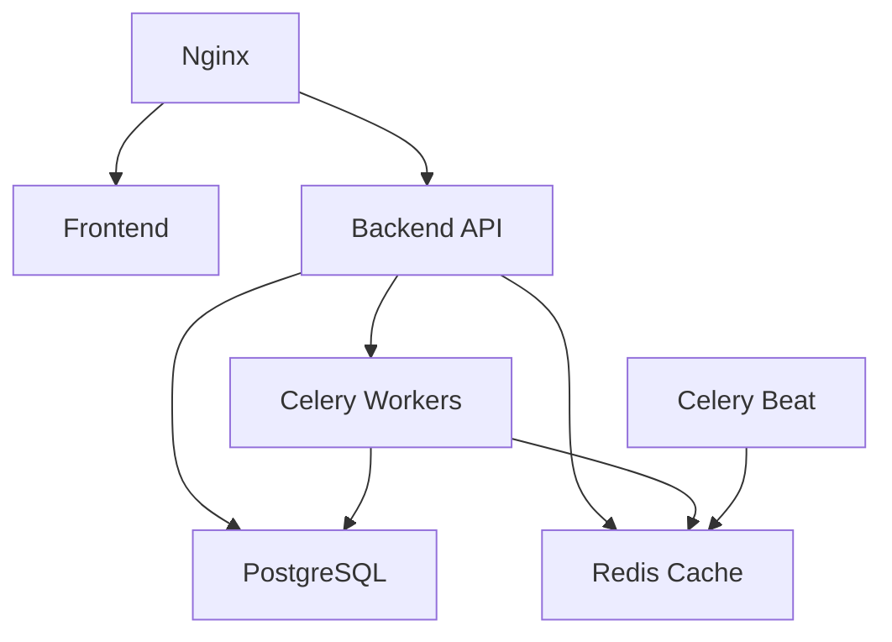

# SpaceX Launch Tracker - Operational Procedures

This document provides comprehensive operational procedures for the SpaceX Launch Tracker system, including deployment, monitoring, maintenance, and troubleshooting.

## Table of Contents

1. [System Overview](#system-overview)
2. [Deployment Procedures](#deployment-procedures)
3. [Monitoring and Health Checks](#monitoring-and-health-checks)
4. [Maintenance Procedures](#maintenance-procedures)
5. [Troubleshooting Guide](#troubleshooting-guide)
6. [Performance Optimization](#performance-optimization)
7. [Security Procedures](#security-procedures)
8. [Backup and Recovery](#backup-and-recovery)
9. [Scaling Procedures](#scaling-procedures)
10. [Emergency Procedures](#emergency-procedures)

## System Overview

### Architecture Components

The SpaceX Launch Tracker consists of the following components:

- **Frontend**: Next.js application serving the user interface
- **Backend**: FastAPI application providing REST API
- **Database**: PostgreSQL for persistent data storage
- **Cache**: Redis for caching and session storage
- **Task Queue**: Celery with Redis broker for background tasks
- **Web Server**: Nginx for reverse proxy and static file serving
- **Monitoring**: Health check endpoints and logging

### Service Dependencies



## Deployment Procedures

### Pre-Deployment Checklist

- [ ] All tests pass (run `python scripts/run_system_tests.py`)
- [ ] Environment variables configured
- [ ] Database migrations ready
- [ ] SSL certificates valid
- [ ] Backup completed
- [ ] Monitoring alerts configured

### Production Deployment

#### 1. Automated Deployment (Recommended)

```bash
# Deploy using the deployment script
python scripts/deploy.py production

# Or trigger via CI/CD pipeline
git push origin main
```

#### 2. Manual Deployment

```bash
# 1. Pull latest code
git pull origin main

# 2. Build and deploy containers
docker-compose -f docker-compose.prod.yml build
docker-compose -f docker-compose.prod.yml up -d

# 3. Run database migrations
python scripts/migrate.py --safe

# 4. Warm caches
curl -X POST http://localhost:8000/api/admin/cache/warm \
  -H "Authorization: Bearer $ADMIN_TOKEN"

# 5. Verify deployment
python scripts/run_system_tests.py --quick
```

### Rollback Procedures

```bash
# 1. Stop current deployment
docker-compose -f docker-compose.prod.yml down

# 2. Restore previous version
git checkout <previous-commit>
docker-compose -f docker-compose.prod.yml up -d

# 3. Restore database if needed
python scripts/migrate.py --restore backups/backup_YYYYMMDD_HHMMSS.sql

# 4. Verify rollback
curl http://localhost:8000/health
```

## Monitoring and Health Checks

### Health Check Endpoints

| Endpoint | Purpose | Expected Response |
|----------|---------|-------------------|
| `/health` | Overall system health | 200 OK or 503 Service Unavailable |
| `/health/database` | Database connectivity | 200 OK or 503 Service Unavailable |
| `/health/redis` | Redis connectivity | 200 OK or 503 Service Unavailable |
| `/health/celery` | Background task status | 200 OK or 503 Service Unavailable |

### Monitoring Commands

```bash
# Check all services status
docker-compose -f docker-compose.prod.yml ps

# View service logs
docker-compose -f docker-compose.prod.yml logs -f [service-name]

# Check system resources
docker stats

# Monitor API performance
curl -w "@curl-format.txt" -o /dev/null -s http://localhost:8000/api/launches
```

### Key Metrics to Monitor

1. **API Response Times**: Should be < 1 second for cached content
2. **Database Query Performance**: Should be < 100ms for typical queries
3. **Cache Hit Rate**: Should be > 80% for frequently accessed data
4. **Scraping Success Rate**: Should be > 90% for data collection
5. **Error Rate**: Should be < 1% for API requests
6. **Memory Usage**: Should be < 80% of available memory
7. **CPU Usage**: Should be < 70% average

### Alerting Thresholds

- **Critical**: API down, database unavailable, high error rate (>5%)
- **Warning**: High response times (>2s), low cache hit rate (<70%), scraping failures
- **Info**: Deployment completed, cache cleared, scheduled maintenance

## Maintenance Procedures

### Daily Maintenance

```bash
# Check system health
curl http://localhost:8000/health

# Review logs for errors
docker-compose -f docker-compose.prod.yml logs --since=24h | grep -i error

# Check disk space
df -h

# Verify backup completion
ls -la backups/ | tail -5
```

### Weekly Maintenance

```bash
# Update system packages (if applicable)
sudo apt update && sudo apt upgrade

# Clean up old Docker images
docker system prune -f

# Rotate logs
logrotate /etc/logrotate.d/spacex-tracker

# Review performance metrics
python scripts/performance_report.py --week
```

### Monthly Maintenance

```bash
# Database maintenance
python scripts/migrate.py --analyze
python scripts/migrate.py --vacuum

# Security updates
python scripts/security_check.py

# Performance optimization
python scripts/optimize_database.py

# Backup verification
python scripts/verify_backups.py
```

### Quarterly Maintenance

- Review and update dependencies
- Security audit and penetration testing
- Capacity planning and scaling assessment
- Disaster recovery testing
- Documentation updates

## Troubleshooting Guide

### Common Issues and Solutions

#### 1. API Server Not Responding

**Symptoms**: HTTP 502/503 errors, connection timeouts

**Diagnosis**:
```bash
# Check if backend container is running
docker ps | grep backend

# Check backend logs
docker logs spacex_backend_prod

# Check resource usage
docker stats spacex_backend_prod
```

**Solutions**:
```bash
# Restart backend service
docker-compose -f docker-compose.prod.yml restart backend

# If memory issues, increase container limits
# Edit docker-compose.prod.yml and restart

# Check database connectivity
docker exec spacex_backend_prod python -c "from src.database import get_database_manager; get_database_manager().test_connection()"
```

#### 2. Database Connection Issues

**Symptoms**: Database connection errors, slow queries

**Diagnosis**:
```bash
# Check PostgreSQL status
docker exec spacex_postgres_prod pg_isready -U spacex_user

# Check connection count
docker exec spacex_postgres_prod psql -U spacex_user -d spacex_launches -c "SELECT count(*) FROM pg_stat_activity;"

# Check for long-running queries
docker exec spacex_postgres_prod psql -U spacex_user -d spacex_launches -c "SELECT query, state, query_start FROM pg_stat_activity WHERE state = 'active';"
```

**Solutions**:
```bash
# Restart PostgreSQL
docker-compose -f docker-compose.prod.yml restart postgres

# Kill long-running queries
docker exec spacex_postgres_prod psql -U spacex_user -d spacex_launches -c "SELECT pg_terminate_backend(pid) FROM pg_stat_activity WHERE state = 'active' AND query_start < now() - interval '5 minutes';"

# Optimize database
python scripts/optimize_database.py
```

#### 3. Redis/Cache Issues

**Symptoms**: Slow response times, cache misses

**Diagnosis**:
```bash
# Check Redis status
docker exec spacex_redis_prod redis-cli ping

# Check Redis memory usage
docker exec spacex_redis_prod redis-cli info memory

# Check cache hit rate
docker exec spacex_redis_prod redis-cli info stats | grep hit
```

**Solutions**:
```bash
# Restart Redis
docker-compose -f docker-compose.prod.yml restart redis

# Clear cache if corrupted
docker exec spacex_redis_prod redis-cli flushall

# Warm cache
curl -X POST http://localhost:8000/api/admin/cache/warm -H "Authorization: Bearer $ADMIN_TOKEN"
```

#### 4. Celery Task Issues

**Symptoms**: Scraping not updating, background tasks failing

**Diagnosis**:
```bash
# Check Celery worker status
docker logs spacex_celery_worker_prod

# Check task queue
docker exec spacex_redis_prod redis-cli llen celery

# Check for failed tasks
curl http://localhost:8000/api/admin/celery/failed
```

**Solutions**:
```bash
# Restart Celery workers
docker-compose -f docker-compose.prod.yml restart celery-worker celery-beat

# Clear failed tasks
docker exec spacex_redis_prod redis-cli del celery

# Manually trigger scraping
curl -X POST http://localhost:8000/api/admin/refresh -H "Authorization: Bearer $ADMIN_TOKEN"
```

#### 5. Frontend Issues

**Symptoms**: Page not loading, JavaScript errors

**Diagnosis**:
```bash
# Check frontend container
docker logs spacex_frontend_prod

# Check Nginx configuration
docker exec spacex_nginx_prod nginx -t

# Check static file serving
curl -I http://localhost:3000/_next/static/css/app.css
```

**Solutions**:
```bash
# Restart frontend
docker-compose -f docker-compose.prod.yml restart frontend

# Rebuild frontend if needed
docker-compose -f docker-compose.prod.yml build frontend
docker-compose -f docker-compose.prod.yml up -d frontend

# Clear browser cache and test
```

### Performance Issues

#### High Response Times

1. **Check cache hit rates**
2. **Analyze slow database queries**
3. **Review API endpoint performance**
4. **Check system resource usage**

#### Memory Leaks

1. **Monitor container memory usage over time**
2. **Check for unclosed database connections**
3. **Review application logs for memory warnings**
4. **Restart services if memory usage is excessive**

#### High CPU Usage

1. **Identify CPU-intensive processes**
2. **Check for infinite loops in scraping tasks**
3. **Review database query performance**
4. **Scale horizontally if needed**

## Performance Optimization

### Database Optimization

```sql
-- Analyze table statistics
ANALYZE launches;
ANALYZE launch_sources;

-- Check index usage
SELECT schemaname, tablename, attname, n_distinct, correlation 
FROM pg_stats 
WHERE tablename IN ('launches', 'launch_sources');

-- Optimize queries
EXPLAIN ANALYZE SELECT * FROM launches WHERE status = 'upcoming' ORDER BY launch_date;
```

### Cache Optimization

```bash
# Monitor cache performance
redis-cli info stats

# Optimize cache expiration times
# Edit cache configuration in src/cache/cache_manager.py

# Implement cache warming for frequently accessed data
curl -X POST http://localhost:8000/api/admin/cache/warm
```

### API Optimization

- Implement response compression
- Use appropriate HTTP caching headers
- Optimize database queries
- Implement pagination for large datasets
- Use connection pooling

## Security Procedures

### Security Checklist

- [ ] SSL certificates are valid and up to date
- [ ] All default passwords changed
- [ ] Database connections use SSL
- [ ] API rate limiting enabled
- [ ] CORS properly configured
- [ ] Security headers implemented
- [ ] Regular security updates applied
- [ ] Access logs monitored

### Security Monitoring

```bash
# Check for suspicious API access
grep "429\|401\|403" /var/log/nginx/access.log | tail -20

# Monitor failed login attempts
grep "authentication failed" logs/spacex_tracker.log

# Check SSL certificate expiration
openssl x509 -in /path/to/cert.pem -noout -dates
```

### Incident Response

1. **Identify and contain the threat**
2. **Assess the impact and scope**
3. **Implement immediate fixes**
4. **Document the incident**
5. **Review and improve security measures**

## Backup and Recovery

### Backup Procedures

#### Automated Daily Backups

```bash
# Database backup (automated via cron)
0 2 * * * /path/to/scripts/migrate.py --backup

# Application data backup
0 3 * * * tar -czf /backups/app_$(date +\%Y\%m\%d).tar.gz /app/logs /app/uploads
```

#### Manual Backup

```bash
# Create database backup
python scripts/migrate.py --backup

# Backup configuration files
tar -czf config_backup_$(date +%Y%m%d).tar.gz .env.production docker-compose.prod.yml nginx/
```

### Recovery Procedures

#### Database Recovery

```bash
# Stop application services
docker-compose -f docker-compose.prod.yml stop backend celery-worker celery-beat

# Restore database
python scripts/migrate.py --restore backups/backup_20240131_120000.sql

# Restart services
docker-compose -f docker-compose.prod.yml start backend celery-worker celery-beat
```

#### Full System Recovery

```bash
# 1. Restore from backup
git checkout <last-known-good-commit>

# 2. Restore database
python scripts/migrate.py --restore <backup-file>

# 3. Restore configuration
tar -xzf config_backup_YYYYMMDD.tar.gz

# 4. Rebuild and restart services
docker-compose -f docker-compose.prod.yml build
docker-compose -f docker-compose.prod.yml up -d

# 5. Verify system health
python scripts/run_system_tests.py --quick
```

## Scaling Procedures

### Horizontal Scaling

#### Scale Backend Services

```bash
# Scale API backend
docker-compose -f docker-compose.prod.yml up -d --scale backend=3

# Scale Celery workers
docker-compose -f docker-compose.prod.yml up -d --scale celery-worker=3

# Update load balancer configuration
# Edit nginx/nginx.conf to include new backend instances
```

#### Database Scaling

```bash
# Set up read replicas
# Configure PostgreSQL streaming replication

# Update application to use read replicas for queries
# Edit database configuration in src/database.py
```

### Vertical Scaling

```yaml
# Update docker-compose.prod.yml
services:
  backend:
    deploy:
      resources:
        limits:
          memory: 2G
          cpus: '1.0'
        reservations:
          memory: 1G
          cpus: '0.5'
```

### Auto-scaling with Docker Swarm

```bash
# Initialize Docker Swarm
docker swarm init

# Deploy stack with auto-scaling
docker stack deploy -c docker-compose.prod.yml spacex-tracker

# Configure auto-scaling
docker service update --replicas-max-per-node 2 spacex-tracker_backend
```

## Emergency Procedures

### System Down Emergency

1. **Immediate Response**:
   ```bash
   # Check all services
   docker-compose -f docker-compose.prod.yml ps
   
   # Restart all services
   docker-compose -f docker-compose.prod.yml restart
   ```

2. **If restart fails**:
   ```bash
   # Stop all services
   docker-compose -f docker-compose.prod.yml down
   
   # Start with fresh containers
   docker-compose -f docker-compose.prod.yml up -d
   ```

3. **If database is corrupted**:
   ```bash
   # Restore from latest backup
   python scripts/migrate.py --restore backups/latest_backup.sql
   ```

### Data Loss Emergency

1. **Stop all write operations**
2. **Assess the extent of data loss**
3. **Restore from the most recent backup**
4. **Verify data integrity**
5. **Resume normal operations**
6. **Investigate root cause**

### Security Breach Emergency

1. **Immediately isolate affected systems**
2. **Change all passwords and API keys**
3. **Review access logs**
4. **Apply security patches**
5. **Notify stakeholders**
6. **Document the incident**

## Contact Information

### Emergency Contacts

- **System Administrator**: [contact-info]
- **Database Administrator**: [contact-info]
- **Security Team**: [contact-info]
- **Development Team**: [contact-info]

### Escalation Procedures

1. **Level 1**: System Administrator
2. **Level 2**: Senior System Administrator + Development Team Lead
3. **Level 3**: CTO + Security Team

### Support Resources

- **Documentation**: `/docs/`
- **Runbooks**: `/docs/runbooks/`
- **Monitoring Dashboard**: [URL]
- **Log Aggregation**: [URL]
- **Issue Tracking**: [URL]

---

**Document Version**: 1.0  
**Last Updated**: January 2024  
**Next Review**: April 2024